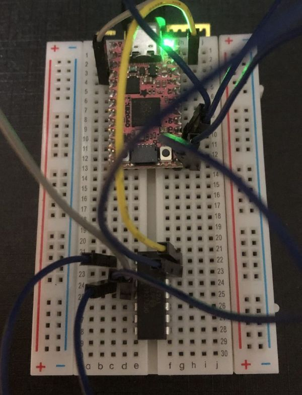
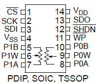
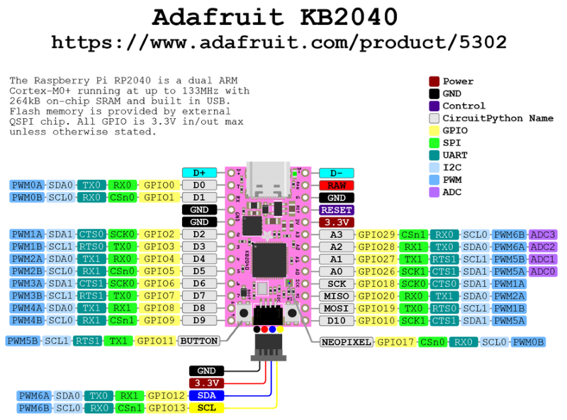
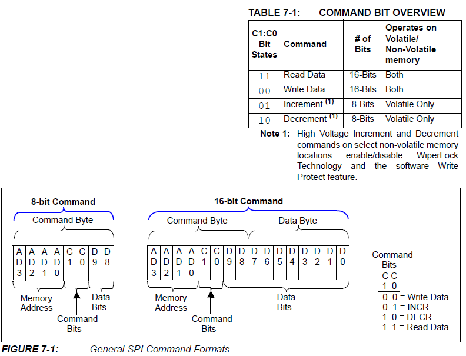

<!-- 
デジタルポテンショの使い方
==========================
 -->

SPI制御のデジタルポテンショが使えるようになったので、使い方をまとめます。

{width=300}

テスト回路のセットアップ
------------------------

- デジタルポテンショ: MCP4261-502
  - 抵抗: 5 kΩ
  - 分解能: 8 bit（0 Ω-5 kΩを257step）
  - チャンネル数: 2
  - 通信法: SPI
- 制御マイコン: KB2040
  - 使用コード: CircuitPython
  - 使用エディタ: MuEditor

### MCP4261

- [データシート](digi-pod/MCP4261_datasheet.pdf)



- Vss, Vdd
  - Vss (GND), Vdd (2.7 V-5.5 V)
- $\overline{\text{CS}}$
  - Chip Select
  - Lにするとシリアルコマンド有効
- SCK, SDI, SDO
  - シリアルクロック、シリアルデータ入力、シリアルデータ出力
- $\overline{\text{WP}}$
  - 不揮発性メモリーを強制的に書き込み禁止にする
- $\overline{\text{SHDN}}$
  - レジスタネットワーク端子をハードウェアシャットダウン状態にする

### KB2040



### 接続

| KB2040 |        MCP4261         | 備考           |
| :----: | :--------------------: | -------------- |
|  RAW   |          Vdd           | 正電源（+5 V） |
|  GND   |          Vss           | グラウンド     |
|  SCK   |          SCK           | クロック       |
|  MISO  |          SDO           | 読み込み       |
|  MOSI  |          SDI           | 書き込み       |
|  D10   | $\overline{\text{CS}}$ | チップセレクト |


SPIコマンド
-----------

とりあえず、抵抗の値の書き込みと読み込みだけを目指します。

### SPI mode

（8ビット・バイトの）1番目のクロック・ビットの立ち上がりエッジにおけるSDIピンの状態によって、以下の2つのモードのどちらかに決定される。

- MODE 0,0
  - 待機状態のSCK: L
  - SCKの立ち上がりエッジでSDIがクロック入力
  - SCKの立ち下がりエッジでSDOがクロック入力
- MODE 1,1
  - 待機状態のSCK: H
  - SCKの立ち上がりエッジでSDIがクロック入力
  - SCKの立ち下がりエッジでSDOがクロック入力


### Command byte

MCP4261のSPIコマンドの概要は、データシートの下図を参照します。



- Memory Address (4 bit): アクセスする機能を指定
  - `0b0000`: ワイパー0（揮発性）
  - `0b0001`: ワイパー1（揮発性）
  - `0b0010`: ワイパー0（不揮発性）
  - `0b0011`: ワイパー1（不揮発性）
- Command Bits (2 bit): 機能に送るコマンドを指定
  - `0b11`: データ読み込み
  - `0b00`: データ書き込み
  - `0b01`: インクリメント（+1）
  - `0b10`: デクリメント（-1）
- Data Bits
  - 書き込み/読み込みの場合は10 bit（D9:D0）
    - D9は書き込み時は未使用で`0`にしておく、読み込み時はコマンドエラービットに対応（1: valid, 0: invalid）
    - [D8:D0]は、フルスケール: `0b1_0000_0000`、最小値: `0b0_0000_0000`
  - インクリメント/デクリメントの場合は2 bit（D9:D8）、ただし使用しない


CircuitPythonでのSPI通信
------------------------

### SPIプロトコル

CircuitPythonでSPI通信を行うには、`board`, `busio`, `digitalio`モジュールをインストールする必要があります。

```python
import board
import busio
import digitalio
```

CSラインは単なるデジタルI/Oなので、`digitalio`モジュールを使って制御します。

```python
cs = digitalio.DigitalInOut(board.D10)
cs.direction = digitalio.Direction.OUTPUT
cs.value = True
```

次に、SPIハードウェアバスへのインターフェイスを作成します。まず、`busio.SPI`クラスのインスタンスを作成します。

```python
spi = busio.SPI(board.SCK, MISO=board.MISO, MOSI=board.MOSI)
```

SPIバスに対して呼び出しを行う前に、「ロック」してコードがSPIに排他的にアクセスできるようにします。`busio.SPI.try_lock()`関数を待ち、終了したら`busio.SPI.unlock()`関数を呼び出すなど、バスをロックする方法はいくつかあります。バスをロックすることで、CircuitPythonにこのコードがSPIを使う必要があること、そしてSPIを使う他のコードはこのコードが終わるまで待つ必要があることを伝えます。これは、異なるコードが同じハードウェアペリフェラルを同時に使おうとしたり、お互いに割り込んだりしないようにするためです。

ここでは、SPIバスをロックするのに`busio.SPI.try_lock()`関数が成功するのを待つループ構文を使います。

```python
while not spi.try_lock():
    pass
```

このループは、SPIバスがロックされて`try_lock()`関数がtrueを返すまで、`try_lock()`関数を呼び出し続けます。他のコードがバスを使用しているかもしれないので、このループはバスをロックし、バスが使用可能であることを確認し続けます。バスがロックされたら、アクセスするための関数を呼び出し始めることができます。 

```python
spi.configure(baudrate=5000000, phase=0, polarity=0)
cs.value = False  # CS端子をLにして通信開始
result = bytearray(4)  # 4バイトの変数を初期化
spi.readinto(result)  # SPIで読み出した内容をresultに保存
cs.value = True  # CS端子をHにして通信終了
```

`busio.SPI.readinto()`関数は、4バイトのデータを読み出すために呼び出されます。渡されたバッファのサイズによって、何バイトのデータが読み込まれるかが決まります。

MOSIライン上でデータを送信するためには、`busio.SPI.write()`関数を使用します。例えば、0x01, 0xFFのバイトを送信するには次のように実行します。

```python
spi.configure(baudrate=5000000, phase=0, polarity=0)
cs.value = False  # CS端子をLにして通信開始
spi.write(bytes([0x01, 0xFF]))  # 2バイトの書き込み
cs.value = True  # CS端子をHにして通信終了
```

最後に`busio.SPI.unlock()`を実行してSPIバスのロックを解除し、他のコードがSPIバスを使えるようにします。

```python
busio.SPI.unlock()
```

try-finallyブロックの中に記述して、たとえ何かが失敗したとしてもunlockが常に呼び出されるようにするとよいです。

```python
while not spi.try_lock():
    pass

try:
    spi.configure(baudrate=5000000, phase=0, polarity=0)
    cs.value = False  # CS端子をLにして通信開始
    result = bytearray(4)  # 4バイトの変数を初期化
    spi.readinto(result)  # SPIで読み出した内容をresultに保存
    cs.value = True  # CS端子をHにして通信終了
finally:
    spi.unlock()

result
```


### SPIDeviceライブラリ

組み込みAPIを使うには、SPIバスにアクセスするためのロックとアンロック関数を注意深く管理し、デバイスのチップセレクトラインを明示的に操作する必要があります。SPIデバイスと通信するコードを書くなら、CircuitPythonのバスデバイスライブラリを使う方が、ロックとアンロック、チップセレクトラインを自動で制御してくれるので管理が少し楽になります。

バスデバイスライブラリを使うには、ボードにライブラリをインストールする必要があります。[最新版のダウンロードページ](https://github.com/adafruit/Adafruit_CircuitPython_Bundle/releases/latest)に行き、
`adafruit-circuitpython-bundle-9.x-mpy-yyyymmdd.zip` をダウンロードします。展開した中の`lib`フォルダにある**adafruit_bus_device**フォルダをボードの`CIRCUITPY`ドライブの`lib`フォルダにコピーします。

バスデバイスライブラリをインストールしたら、SPIDeviceクラスを使ってSPIバス上のデバイスへのアクセスを簡素化できます。まず、SPIバスとCSラインを前項と同じようにセットアップします

```python
import board
import busio
import digitalio
spi = busio.SPI(board.SCK, MISO=board.MISO, MOSI=board.MOSI)
cs = digitalio.DigitalInOut(board.D10)
```

次にバスデバイスモジュールをインポートし、SPIDeviceクラスのインスタンスを作成します。SPIDeviceクラスには、SPIバス、チップセレクトライン、ボーレート、極性、SPI接続の位相を知らせる必要があります。

```python
from adafruit_bus_device.spi_device import SPIDevice
device = SPIDevice(spi, cs, baudrate=5000000, polarity=0, phase=0)
```

これで、SPIデバイス・インスタンスと対話する準備が整いました。今回はコードをwith構文に置くことで、自動的にバスをロックし、CSラインを確認し、SPIバスを設定します。完了したらバスをアンロックします。

```python
with device:
    result = bytearray(4)  # 4バイトの変数を初期化
    spi.readinto(result)  # SPIで読み出した内容をresultに保存

result
```

configureを呼び出したり、CSラインをHighからLowに変更したり戻したりする必要はなく、SPIDeviceクラスがすべて自動的に処理してくれます。


CircuitPythonによるMCP4261の制御
--------------------------------

SPIDeviceライブラリを使ってMCP4261を制御する関数を作ります。とりあえず、抵抗の値の書き込みと読み込みだけを目指します。

### 書き込み

ポテンショのポジションを揮発性メモリに書き込む関数。

```python
def pod_write(device, wiper, val):
    if val > 256:
        val = 256
    if val < 0:
        val = 0
    buf = (wiper << 12 | 0b00 << 10 | val)  # D12にwiper, [D11:D10]に書き込みコマンド, [D8:D0]にval
    with device:
        spi.write(buf.to_bytes(2, 'big'))  # バッファのデータを書き込む
```

- device: SPIデバイス・インスタンス
- wiper: ポテンショの番号。`0` or `1`
- val: 0-256


### 読み込み

ポテンショのポジションを揮発性メモリから読み込む関数。

```python
def pod_read(device, wiper):
    buf = (wipre << 12 | 0b11 << 10)  # D12にwiper, [D11:D10]に読み込みコマンド
    with device:
        result = bytearray(2)
        spi.write_readinto(buf.to_bytes(2, 'big'), result)  # 書き込みと読み込みを同時に行う
    return (result[0] & 0b0000_0001) << 8 | result[1]  # 2バイト[D15:D0]から[D8:D0]を取り出してデコード
```

- device: SPIデバイス・インスタンス
- wiper: ポテンショの番号。`0` or `1`


### テストコード

```python
# === パッケージ読み込み ===
import board
import busio
import digitalio
from adafruit_bus_device.spi_device import SPIDevice
import time

# === SPIバスとCSのセットアップ ===
spi = busio.SPI(board.SCK, MISO=board.MISO, MOSI=board.MOSI)
cs = digitalio.DigitalInOut(board.D10)

# === SPIDeviceインスタンスの作成 ===
device = SPIDevice(spi, cs, baudrate=1000000, polarity=0, phase=0)

# === 関数の作成 ===
def pod_write(device, wiper, val):
    if val > 256:
        val = 256
    if val < 0:
        val = 0
    buf = (wiper << 12 | 0b00 << 10 | val)  # D12にwiper, [D11:D10]に書き込みコマンド, [D8:D0]にval
    with device:
        spi.write(buf.to_bytes(2,'big'))

def pod_read(device, wiper):
    buf = (wiper << 12 | 0b11 << 10)  # D12にwiper, [D11:D10]に読み込みコマンド
    with device:
        result = bytearray(2)
        spi.write_readinto(buf.to_bytes(2,'big'), result)
    return (result[0] & 0b0000_0001) << 8 | result[1]  # 2バイト[D15:D0]から[D8:D0]を取り出してデコード

# === メインループ ===
p = 0
step = 1   
while True:
    if p > 256:
        direction = -1
    if p < 0:
        direction = 1
    p = p + direction * step
    
    pod_write(device, 0, p)  # ポテンショポジションの書き込み
    print(pod_read(device, 0))  # ポジションの読み込み
    
    time.sleep(0.1)
```


参考資料
--------

- [Adafruit SPI Devices ドキュメント](https://learn.adafruit.com/circuitpython-basics-i2c-and-spi/spi-devices)
- [CircuitPython API Reference / busio](https://docs.circuitpython.org/en/latest/shared-bindings/busio/)
- [MicroPython module to control MicroChip's MC4131 SPI digital potentiometer](https://github.com/scruss/mcp4131/tree/main)
- [エレキ素人が何か考える（その５：デジタルポテンショメータ）](https://qiita.com/infinite1oop/items/0637cbe8f2b3af8cdfdc)