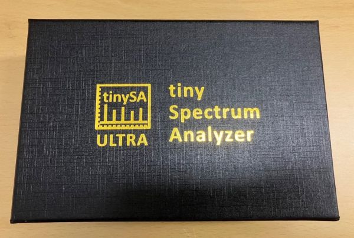
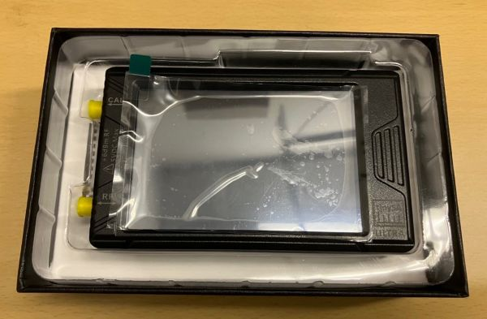
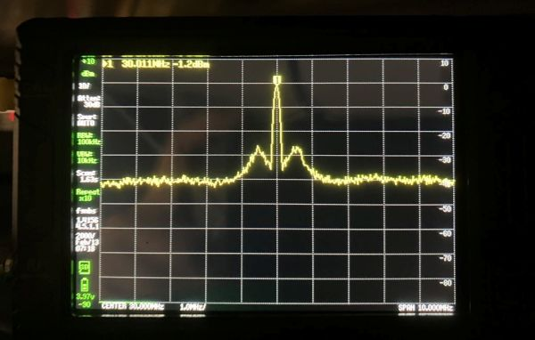
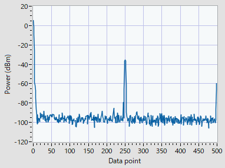
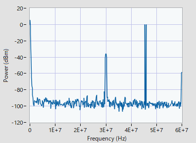

<!-- tinySAのPC制御
============== -->

少し前に話題になった手のひらサイズの格安スペアナtinySA[^1]。
懇意にしているメーカーの方が使っているのを見せていただき、自分も欲しくなって手に入れました。

我々の研究では、それなりに高性能なスペアナが必要となる測定とは別に、適当な性能のスペアナで十分な用途（位相同期のモニタなど）も多く、そういった用途にちょうど良いのではないかと思います。
特に、遠隔地に置く装置の位相同期モニタにはいろいろ事務的な面でも都合がよいだろうと思っています。

[^1]: 話題になったのはnanoVNAの方かも

ここでは、tinySAのPC制御法について簡単にまとめます。


tinySA概要
----------

tinySA Ultraの仕様は以下の通り。

- サイズ: 74 mm x 123 mm x 23 mm
- 周波数範囲: 100 kHz-800 MHz, (Ultra mode 6 GHz)
- RBW: 200 Hz-850 kHz
- ディスプレイ: 4 inch TFT (480x320)
- USBインターフェイス: USB type-C
- カードスロット: microSD
- オーディオ出力: 3.5 mmプラグ端子
- 電源: USB 5V, バッテリ（2時間）

詳細情報は[公式サイト](https://tinysa.org/wiki/pmwiki.php)を参照してください。








PCとの接続
----------

### tinySA側の設定

メニューを開いて
[CONFIG] > [MORE] > [CONNECTION]
で設定可能。

- [USB]を選択
- [SERIAL SPEED]でbaud rateを設定（初期設定は115200）

### ホスト側の設定

tinySAをPCにUSB接続すると、シリアルポートとして認識される。
COM番号を確認してシリアルポート（のbaud rate）を設定する。


tinySAのコマンド制御
--------------------

tinySAの制御コマンドは公式サイトを参照してください。

- [tinySA USB interface](https://tinysa.org/wiki/pmwiki.php?n=Main.USBInterface)

通信時の注意点は以下の通り。

- tinySAとの書き込み/読み取りは、終端文字**LF** (`\r\n`)
- 複数行にわたる場合は、各行末に終端文字を持つ

以下、代表的なコマンドの解説です。


### rbw

RBWを設定します。

- 使用法:
  ```python
  rbw {value}\r\n
  ```
- `{value}`: RBWの値。`auto`か3-600の数値（kHz単位）を入力 
- 応答: 入力と同じコマンド


### resume

tinySAの掃引を再開します。

- 使用法:
  ```python
  resume\r\n
  ```
- 応答: 入力と同じコマンド


### frequencies

最後の掃引で使った周波数軸の値を出力します。

- 使用法:  
  ```python
  frequencies\r\n
  ```

- 応答:
  ```python
  frequencies\r\n
  f[0]\r\n
  f[1]\r\n
  f[2]\r\n
  ...
  ch>
  ```
  - `f[n]`: 周波数配列 （Hz単位）
  - 最終行の`ch>`の後ろには終端文字がない


### scanraw

掃引を実行し、バイナリデータを出力します。後述する**scan**のようにデータ転送の失敗がなく、**hop**のように遅くないので、PCでのデータ取得には最も適しています。



- 使用法:
  ```python
  scanraw {start(Hz)} {stop(Hz)} [points] [option]\r\n
  ```
  - `{start(Hz)}`: 開始周波数（Hz単位）。`500k`, `10M`など接頭辞も使える。
  - `{stop(Hz)}`: 停止周波数（Hz単位）
  - `[points]`: データ点数
  - `[option]`: 出力データに合わせて以下の和を入力する。1: buffered, 2: continuous。今のところ効果がよく分からず、`0`にしている。
- 応答例:
  ```python
  scanraw {start(Hz)} {stop(Hz)} [points] 0\r\n
  {x[MSB0][LSB0]x[MSB1][LSB1]x[MSB2][LSB2]...}ch>
  ```
  - 出力データ文字列は`{}`で囲まれており、その後`ch>`で終わる
  - `cn>`で終わった後には終端文字がない
  - `{}`の中の各データ点は`x[MSBn][LSBn]`の繰り返しで表される
    - `[MSBn]`: n番目データの最上位バイト
    - `[LSBn]`: n番目データの最下位バイト
    - `x`を区切り文字にして2バイトのデータをリトルエディアン形式で表現している
- 2バイトデータを符号なし整数で表示したものを**d**とすると、測定値**y**（dBm単位）は以下のように計算できる
  ```python
  y = d/32 - 128  # for tinySA
  y = d/32 - 172  # for tinySA Ultra
  ```

### scan

掃引を実行し、オプションで測定データを出力します。

- 使用法:
  ```python
  scan {start(Hz)} {stop(Hz)} [points] [outmask]\r\n
  ```
  - `{start(Hz)}`: 開始周波数（Hz単位）。`500k`, `10M`など接頭辞も使える。
  - `{stop(Hz)}`: 停止周波数（Hz単位）
  - `[points]`: データ点数（Ultraの場合、最大450）
  - `[outmask]`: 出力したいデータに合わせて以下の和を入力する。1: 周波数, 2: 測定値, 4: 保存値。周波数と測定値の場合は`3`。
- 応答例:
  ```ps
  scan {start(Hz)} {stop(Hz)} [points] 3\r\n
  f[0] y[0] 0.000000000\r\n
  f[1] y[1] 0.000000000\r\n
  f[2] y[2] 0.000000000\r\n
  ...
  ch>
  ```
  - `f[n]`: 周波数配列（Hz単位）
  - `y[n]`: 測定値配列（dBm単位）
  - なぜか`y[n]`の隣に`0.000000000`が並ぶ。理由不明。
  - 最終行の`ch>`の後ろには終端文字がない

scanでデータを取得すると、下図のように取得に失敗するデータ点があるので、PCでのデータ取得には使えません。




### hop (Ultraのみ)

設定した周波数における信号レベルを測定し、出力します。**scan**の上位版と思えば良いです。ただし、**scan**, **scanraw**に比べて読み出しの時間がかかります。

- 使用法:
  ```python
  hop {start(Hz)} {stop(Hz)} {step(Hz) | points} [outmask]\r\n
  ```
  - `{start(Hz)}`: 開始周波数（Hz単位）。`500k`, `10M`など接頭辞も使える。
  - `{stop(Hz)}`: 停止周波数（Hz単位）
  - `{step(HZ) | points}`: ステップ周波数（Hz単位）またはデータ点数を入力。数値が450以下の場合はデータ点数と認識され、450を超えるとステップ周波数と認識される。
  - `[outmask]`: 出力したいデータに合わせて以下の和を入力する。1: 周波数, 2: 測定値。
- 応答例:
  ```python
  hop {start(Hz)} {stop(Hz)} 450 3\r\n
  f[0] y[0]\r\n
  f[1] y[1]\r\n
  f[2] y[2]\r\n
  ...
  ch>
  ```
  - `f[n]`: 周波数配列（Hz単位）
  - `y[n]`: 測定値配列（dBm単位）
  - 最終行の`ch>`の後ろには終端文字がない


tinySAのLabVIEW VI
------------------

鋭意制作中...


参考資料
--------

- [tinySA USB interface](https://tinysa.org/wiki/pmwiki.php?n=Main.USBInterface)
- [tinySA用のPythonライブラリ](http://athome.kaashoek.com/tinySA/python/)
